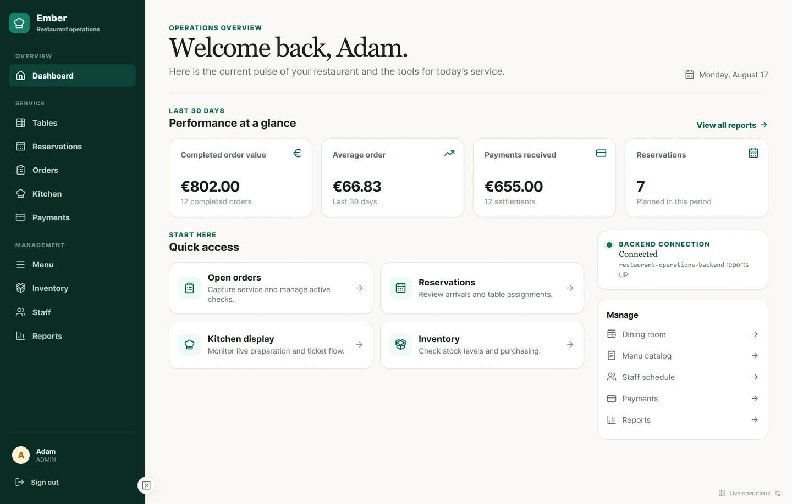
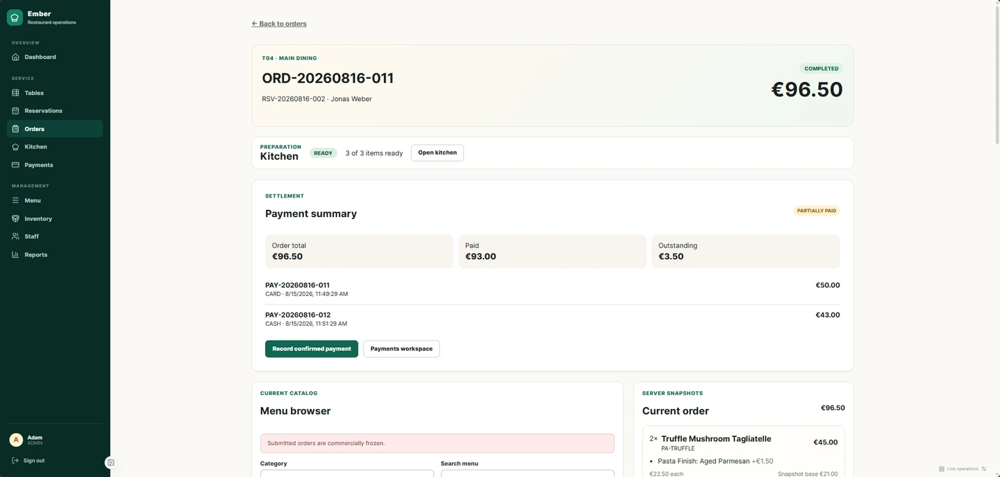
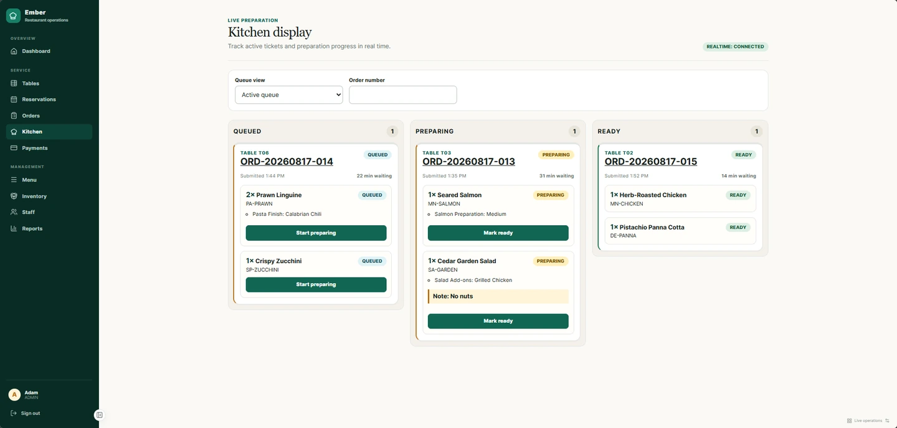
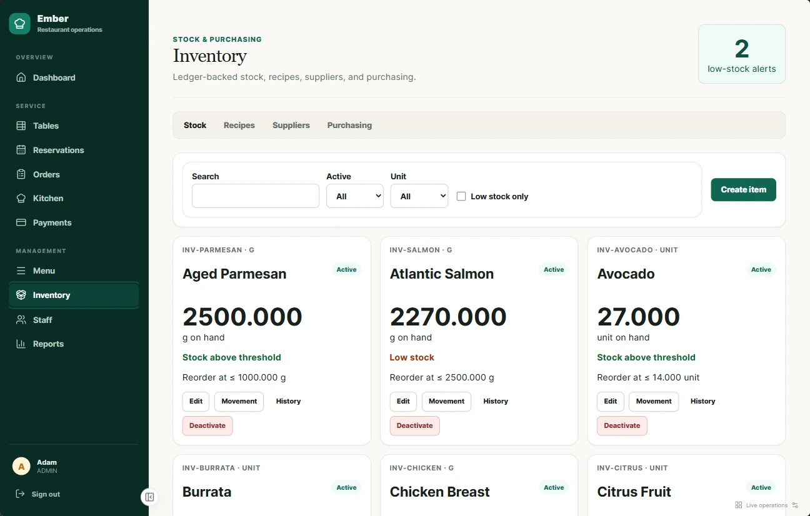
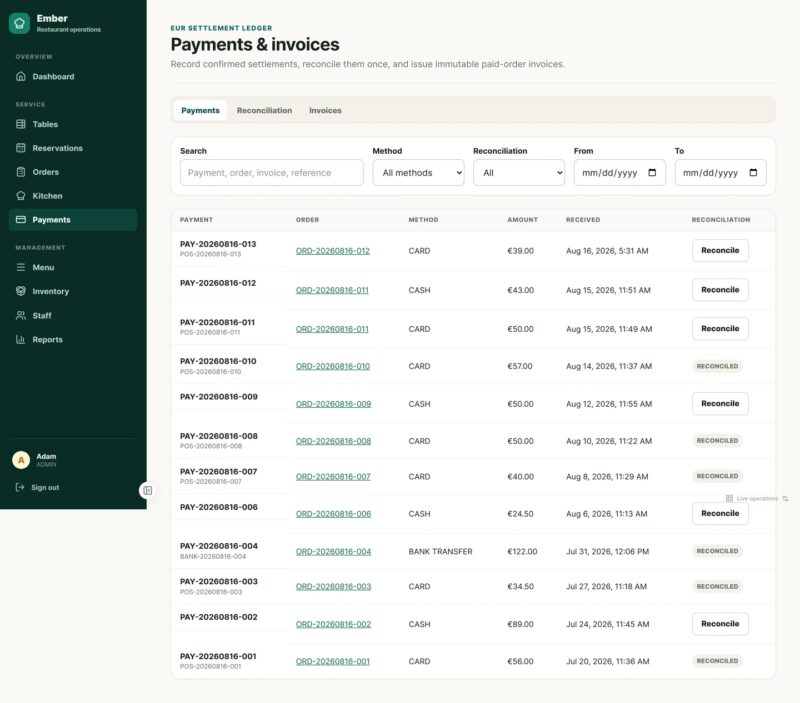
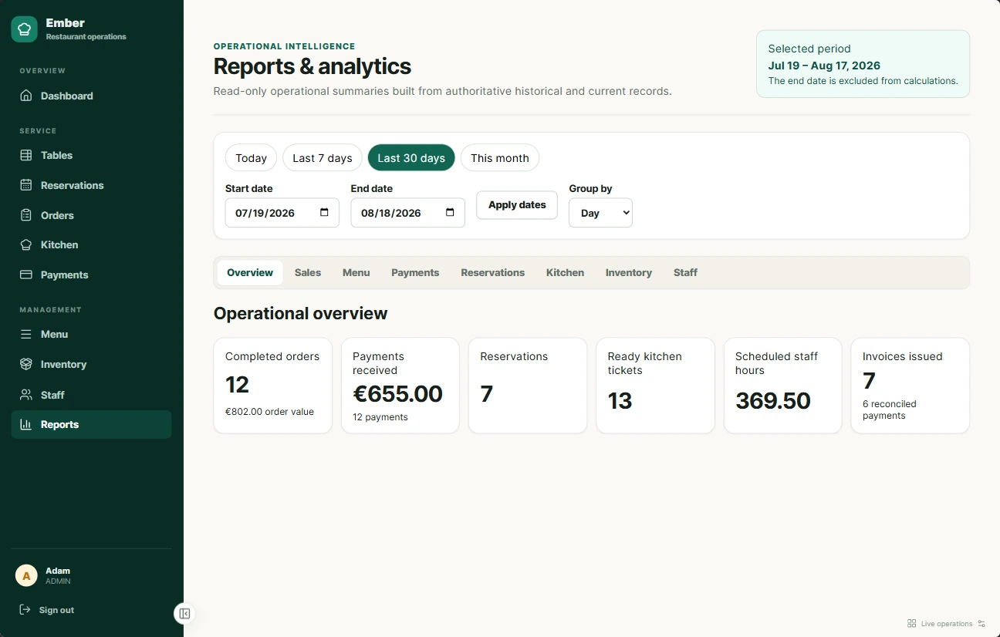
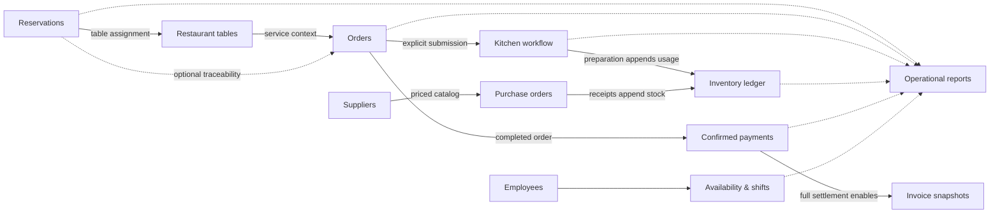
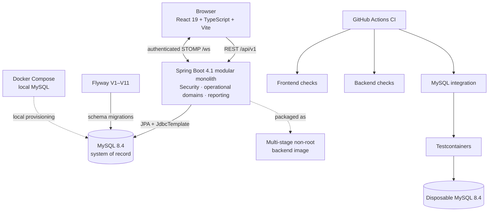

# Restaurant Operations Platform

**A full-stack restaurant operations platform connecting reservations, table service, orders, kitchen workflow, inventory, staff scheduling, payments, invoicing, and operational analytics.**

[](https://github.com/AdamWaleedHatemHossamElden/restaurant-operations-platform/actions/workflows/ci.yml)


[](LICENSE)

This project was built as a deep software-engineering portfolio piece rather than a collection of disconnected CRUD screens. It emphasizes secure session design, transactional business workflows, database-backed concurrency control, immutable history, real-time state recovery, maintainable module boundaries, and automated verification.

> **Status:** Completed as a portfolio project. Production configuration, Docker, health checks, and CI foundations are implemented; public hosting is intentionally optional and currently deferred.

## Why this project stands out

| Engineering focus           | What is implemented                                                                                                                                                                                                                          |
| --------------------------- | -------------------------------------------------------------------------------------------------------------------------------------------------------------------------------------------------------------------------------------------- |
| **Secure authentication**   | BCrypt credentials, short-lived JWT access tokens, rotating opaque refresh tokens stored only as hashes, reuse detection and family revocation, an HttpOnly refresh cookie, memory-only browser access tokens, and startup session recovery. |
| **Transactional workflows** | Connected reservations, orders, kitchen preparation, stock consumption, purchasing, scheduling, settlement, invoicing, and reporting with server-owned business rules.                                                                       |
| **Concurrency correctness** | Optimistic versions for stale-client protection and pessimistic MySQL row locks for reservation conflicts, aggregate order mutations, refresh rotation, schedule overlaps, purchase receipts, and payment races.                             |
| **Immutable history**       | Order and modifier price snapshots, chronological status history, an append-only stock ledger, confirmed payments, one-time reconciliation, and invoice snapshots.                                                                           |
| **Real-time recovery**      | Authenticated STOMP kitchen notifications publish after commit and trigger REST refetches; MySQL remains authoritative through reconnects or missed events.                                                                                  |
| **Quality gates**           | Frontend behavior tests, backend unit/security tests, real MySQL 8.4 Testcontainers integration tests, Checkstyle, ESLint, Prettier, production builds, Flyway validation, and GitHub Actions CI.                                            |

## Application Preview

The showcase dataset presents a connected service day across front-of-house, kitchen, back-office, and reporting workflows.

### Operations overview



_Dashboard — Operational overview across orders, payments, reservations, and current service._

### Order-to-kitchen workflow

| Completed order detail                                                                                                         | Live kitchen workflow                                                                             |
| ------------------------------------------------------------------------------------------------------------------------------ | ------------------------------------------------------------------------------------------------- |
|  |  |
| _Order Detail — Completed-order workflow combining Kitchen state, immutable snapshots, and partial settlement._                | _Kitchen — Real-time submitted-order preparation across queued, preparing, and ready states._     |

### Back-office operations

| Inventory control                                                                                                   | Payment settlement                                                                                                                      |
| ------------------------------------------------------------------------------------------------------------------- | --------------------------------------------------------------------------------------------------------------------------------------- |
|  |  |
| _Inventory — Ledger-backed stock visibility with configurable low-stock thresholds._                                | _Payments — Confirmed settlements, multiple payment methods, linked orders, and reconciliation state._                                  |

### Operational analytics



_Reports — Read-only operational analytics across completed orders, payments, Kitchen, staff, and invoices._

## What the system does

| Area                       | User-facing capabilities and important rules                                                                                                                                                 |
| -------------------------- | -------------------------------------------------------------------------------------------------------------------------------------------------------------------------------------------- |
| **Dashboard**              | Live operational summaries and direct entry points into active restaurant workflows.                                                                                                         |
| **Tables & reservations**  | Manage table capacity and availability, create assigned or unassigned reservations, check suitable tables, and follow controlled reservation states with conflict-safe overlap checks.       |
| **Menu & modifiers**       | Configure categories, menu items, reusable modifier groups, selection rules, exact EUR prices, sale availability, and ordered assignments.                                                   |
| **Orders**                 | Capture table-service orders, select modifiers, preserve commercial snapshots, calculate totals on the server, and follow an explicit open/submitted/completed/cancelled lifecycle.          |
| **Kitchen**                | Work a current-service queue through queued, preparing, and ready states; receive authenticated real-time change notifications; retain historical preparation data.                          |
| **Inventory & recipes**    | Track canonical-unit ingredients through an immutable movement ledger, configure recipes and modifier usage, surface low stock, and record exactly-once consumption when preparation begins. |
| **Suppliers & purchasing** | Maintain supplier catalogs and exact costs, create purchase orders, receive partial deliveries, and append receipt movements without rewriting stock history.                                |
| **Staff & scheduling**     | Manage employees, operational scheduling roles, date-specific availability, weekly shifts, overlap prevention, and terminal shift states.                                                    |
| **Payments & invoices**    | Record confirmed partial or split EUR payments with idempotency and overpayment protection, reconcile settlements once, and issue one immutable invoice for a fully paid completed order.    |
| **Reports & exports**      | Review completed-order sales, menu performance, payments, reservations, kitchen throughput, inventory, and staffing over bounded UTC periods; export formula-safe CSV files.                 |

## Operational flow

The application keeps deliberate user actions explicit while connecting the records needed by downstream operations.



## Technical architecture

The application is a modular monolith: one deployable backend with explicit domain packages and transaction boundaries, paired with an independent React client.



See [Architecture](docs/architecture.md) and [Database design](docs/database-plan.md) for the module and persistence rationale.

## Engineering decisions

1. **REST and MySQL are authoritative.** WebSocket events carry safe identifiers and trigger invalidation; they do not replace durable state.
2. **Commercial values are snapshotted.** Existing order and invoice lines do not change when today's menu names or prices change.
3. **Stock is a ledger.** Receipts, usage, waste, and adjustments append movements instead of mutating a quantity field.
4. **The database settles races.** Concurrency-sensitive commands lock stable aggregate rows and return controlled conflicts rather than trusting cached UI state.
5. **Terminal financial records are immutable.** Confirmed payments, reconciliation, and invoices preserve the evidence used to produce them.
6. **Time boundaries are explicit.** Persisted/API instants use UTC where applicable, browser-local scheduling is converted at the boundary, and report ranges are half-open `[from,to)` intervals.
7. **Operational value and cash received are different metrics.** Reports keep completed-order totals separate from successful payment receipts instead of calling both “revenue.”

## Security and correctness

- Spring Security denies unmatched backend routes by default and requires `ADMIN` authority for operational APIs.
- BCrypt uses strength 12; unknown-user login performs a timing-resistant dummy verification.
- Access tokens are short-lived JWTs with required-claim validation. Refresh tokens are opaque, hashed at rest, rotated atomically, and grouped for reuse-triggered family revocation.
- The browser stores the access token only in memory. The refresh credential is a backend-managed HttpOnly cookie and is never exposed through application JavaScript.
- Refresh and logout require the custom CSRF header across MVC-equivalent paths; credentialed CORS accepts one configured origin.
- Safe API errors distinguish validation, authentication, authorization, missing data, and conflicts without returning request bodies, stack traces, credentials, or token values.
- Production forces secure refresh cookies, disables Swagger, limits Actuator exposure to health, hides framework error details, and receives secrets from environment configuration.

The detailed threat boundaries and deferred deployment controls are documented in the [Security plan](docs/security-plan.md).

## Testing and CI

| Suite                                          |                                                                                         Verified baseline |
| ---------------------------------------------- | --------------------------------------------------------------------------------------------------------: |
| Frontend — Vitest + React Testing Library      |                                                                             **127 tests across 34 files** |
| Backend — JUnit 5, Mockito, MVC/security tests |                                                                                              **82 tests** |
| MySQL — Testcontainers integration suite       |                                                                                 **41 tests on MySQL 8.4** |
| Static/build gates                             | Checkstyle: **0 violations**; ESLint, Prettier, Maven packaging, and the frontend production build passed |

The CI workflow runs three independent jobs on pull requests and `main`: **Frontend**, **Backend**, and **MySQL integration**. Dependabot proposes reviewed weekly updates for npm, Maven, and GitHub Actions.

```powershell
# frontend/
npm ci
npm run format:check
npm run lint
npm run test
npm run build

# backend/ (Windows)
.\mvnw.cmd test
.\mvnw.cmd verify
.\mvnw.cmd -Pintegration-test verify
```

## Technology stack

| Layer               | Technologies                                                                                                                                                                                            |
| ------------------- | ------------------------------------------------------------------------------------------------------------------------------------------------------------------------------------------------------- |
| **Frontend**        | React 19, TypeScript, Vite, React Router, TanStack Query, Axios, React Hook Form, Zod, Lucide React, Vitest, React Testing Library                                                                      |
| **Backend**         | Java 21, Spring Boot 4.1, Spring MVC, Spring Data JPA, Spring Security, Bean Validation, JdbcTemplate reporting, Spring WebSocket/STOMP, Actuator, development OpenAPI, Maven Wrapper, JUnit 5, Mockito |
| **Data & delivery** | MySQL 8.4, Flyway, Docker, Docker Compose, Testcontainers, GitHub Actions, Dependabot                                                                                                                   |

## Run locally

### Prerequisites

- Java 21
- Node.js 22.12 or newer and npm 10+
- Docker with Compose

### 1. Configure the environment

```powershell
Copy-Item .env.example .env
```

Replace every placeholder in the ignored `.env`, then load the required values into the backend terminal session. Spring Boot does not automatically import the root file. At minimum configure the database connection, a 32-byte-or-longer `JWT_SECRET`, and the optional development administrator values. Never put secrets in a `VITE_` variable.

### 2. Start MySQL

```powershell
docker compose up -d mysql
docker compose ps
```

The project maps MySQL to `localhost:3307`; port `3306` remains inside the container.

### 3. Start the backend

```powershell
cd backend
$env:SPRING_PROFILES_ACTIVE = "dev"
.\mvnw.cmd spring-boot:run
```

### 4. Start the frontend

```powershell
cd frontend
npm ci
npm run dev
```

| Local service          | URL                                           |
| ---------------------- | --------------------------------------------- |
| Frontend               | `http://localhost:5173`                       |
| Backend                | `http://localhost:8080`                       |
| API health             | `http://localhost:8080/api/v1/health`         |
| Actuator health        | `http://localhost:8080/actuator/health`       |
| Development Swagger UI | `http://localhost:8080/swagger-ui/index.html` |

## Optional showcase data

The repository includes an opt-in fictional dataset for **Cedar & Stone Kitchen**. It provides coherent current and historical records across every implemented module, with relative timestamps and production-like identifiers suitable for local demonstrations.

- It loads only with the Spring `dev` profile **and** `DEMO_DATA_ENABLED=true`.
- Initialization is transactional and guarded by an idempotency marker.
- Guests, employees, suppliers, contacts, references, and payment records are fictional; no credentials, real PII, card data, or provider secrets are included.
- The seed resource is outside production Flyway locations and cannot load under the `prod` profile.

The showcase requires the configured development administrator to exist. Follow the reset, startup, and safety steps in [Local showcase data](docs/demo-data.md) rather than targeting unrelated Docker volumes.

## Production-readiness foundations

The repository provides a provider-neutral deployment foundation, not a claim of a live public service:

- explicit `prod` Spring profile with mandatory environment-injected database, JWT, and exact-origin settings;
- secure refresh cookies, production-safe errors/logging, forwarded-header handling, disabled Swagger, and health-only Actuator exposure;
- liveness and readiness probes;
- authoritative production Flyway locations that exclude development fixtures;
- multi-stage Java 21 backend image running as a non-root user;
- production frontend API URL validation and route-level code splitting;
- CI and reviewed dependency-update automation.

Hosting, TLS termination, trusted proxy rules, DNS, managed secrets, backup/restore, monitoring, rate limiting, and final live validation remain deployment-specific decisions. See the [Production-readiness runbook](docs/production-readiness.md).

## Documentation

| Document                                                     | Purpose                                                                                               |
| ------------------------------------------------------------ | ----------------------------------------------------------------------------------------------------- |
| [Architecture](docs/architecture.md)                         | Runtime boundaries, module ownership, transaction design, real-time behavior, and testing strategy    |
| [Database design](docs/database-plan.md)                     | Flyway schema, relationships, snapshots, ledgers, constraints, and indexes                            |
| [Security plan](docs/security-plan.md)                       | Authentication, authorization, token/cookie boundaries, safe APIs, and remaining controls             |
| [Product scope](docs/product-scope.md)                       | Product problem, intended users, implemented boundary, and deliberate exclusions                      |
| [Production readiness](docs/production-readiness.md)         | Deployment contract, administrator provisioning, TLS/proxy requirements, health, backup, and rollback |
| [Local showcase data](docs/demo-data.md)                     | Fictional dataset contents, safe activation, reset procedure, and visual checklist                    |
| [Roadmap](docs/roadmap.md)                                   | Incremental delivery history and final presentation status                                            |
| [Testing records](docs/testing/)                             | Phase-by-phase automated, integration, browser, responsive, and security verification notes           |
| [Original project context](docs/original-project-context.md) | Provenance and boundaries of the independent redesign                                                 |

## Project status and boundaries

The implemented product scope and repository presentation are complete for portfolio purposes. Public deployment may be added later, but it is not required to run or evaluate the project locally.

This is a single-restaurant, administrator-operated system. It records confirmed payments but does not process funds or collect card/bank credentials. Customer ordering, multi-restaurant tenancy, employee login/self-service, payroll, taxes, discounts, tips, refunds, and payment-provider integration are intentionally outside the implemented scope.

Development history remains available in the [Roadmap](docs/roadmap.md).

## License

Licensed under the [MIT License](LICENSE).
